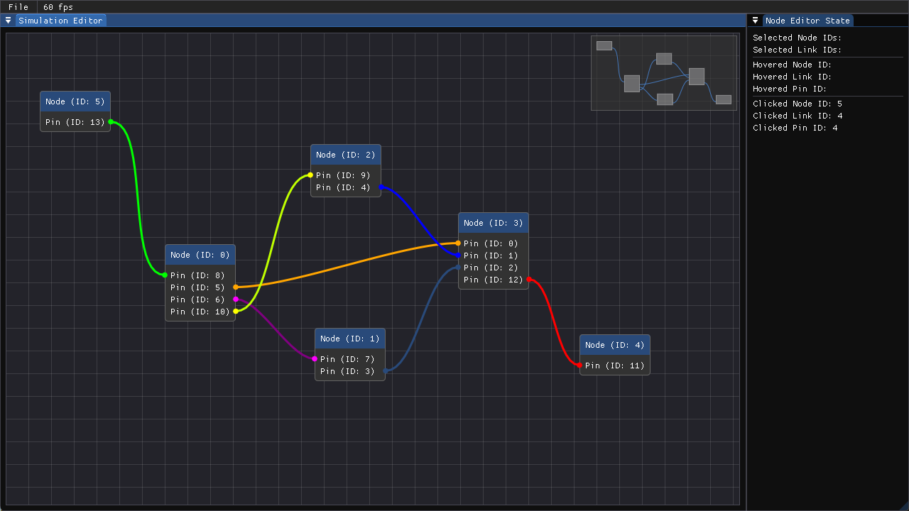

# ImNodes State

This is a small project that I started to experiment around with being able to connect and simulate differrent environments using nodes and linking them together.
Currently, it just acts as state storage for the imgui imnodes library.

Part of the challenge of this project was to use the CMake function FetchContent to be able to handle automatically grabbing all of the dependencies to configure GLAD/GLFW/IMGUI/CATCH2, without and manual downloading/generation of files.

## Requirements

- Python (Packages required: jinja2)
- CMake
- MSVC/GCC

## Tested Environments
- Windows 11
- Linux (Arch Linux through WSL2)

## Building

1. Configuring the CMake project

As with any CMake project, configure it to allow generators/compilers to be found:

```bash
cmake -S . -B ./build
```

2. Building

Due to the way GLAD generates it's files, building the project once is currently required for #include statements to get corrected in the code. The glad.c and glad.h files ares generated, compiled into a static library during the build process.

```bash
cmake --build ./build --config Debug --target all --
```

Note: This might not be necessary anymore in newer CMake versions.

## Node Editor Preview


